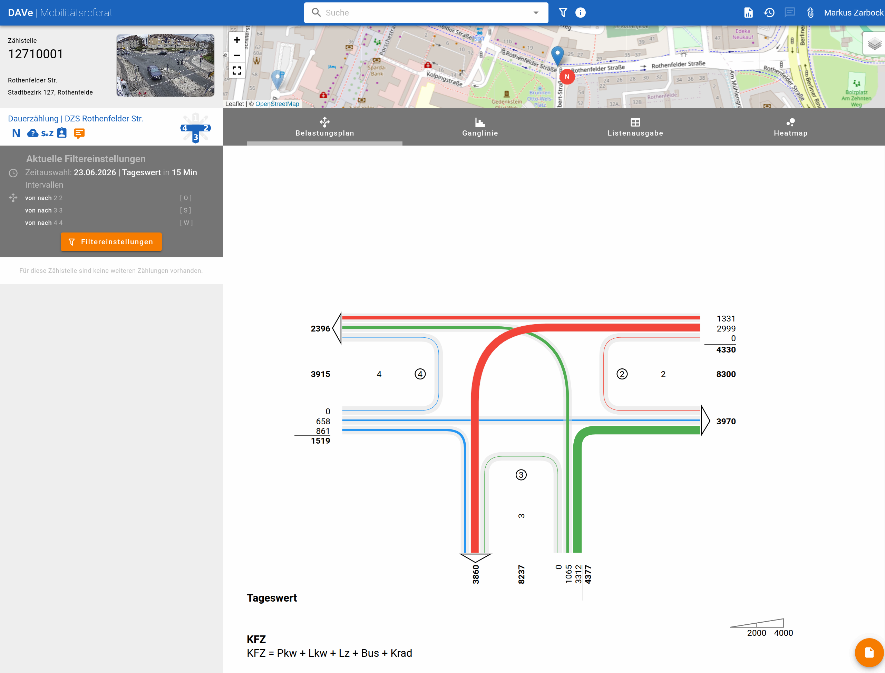

# Deployment tools for DAVe
This repository contains deployment tools for installing the DAVe application. It was started and developed by the city of Munich and you can find more details [here](https://opensource.muenchen.de/de/software/dave.html). 

DAVe is a software to collect, analyze and visualize traffic statistics. One core function is the creation of node stream diagrams. This is very helpful for traffic/city planners as well as real estate developers. The following image shows an example diagram.

It is a multi-component software and thus deployment is not without complexity. Therefore you can find in this repository two ways of deployment: Docker compose and Helmfile. Docker compose is great for development setups and Helmfile is a convienient way to deploy & update composed multi-module applications in one go.

As Starwit is actively developing DAVe please note, that here only Starwit's versions of the various components are being used. Please not also, that software is intended to stay open source and thus license is changed to AGPLv3. See section below for more details.

More information about Starwit's roadmap and latest news refer to our [homepage](https://starwit-technologies.de/products/dave-open-source-traffic-count-analysis-for-modern-mobility-management/).

## Component Breakdown
The DAVe application consists of multiple components. Each component has its own Docker image and Helm chart. The main components are:

| Component        | Repository / URI                                           | Description                  | Docker image | Helm Chart |
| -----------------| -----------------------------------------------------------| -----------------------------| -------------|------------|
| DAVe Backend     | https://github.com/starwit/dave-backend                    | Data Storage & Business Logic| [Link](https://hub.docker.com/r/starwitorg/dave-backend) | [Link](https://hub.docker.com/r/starwitorg/dave-backend-chart) |
| DAVe Frontend    | https://github.com/starwit/dave-frontend                   | Analytics Frontend           | [Link](https://hub.docker.com/r/starwitorg/dave-frontend) | [Link](https://hub.docker.com/r/starwitorg/dave-frontend-chart) |
| DAVe Admin Portal | https://github.com/starwit/dave-admin-portal              | Administration Frontend      | [Link](https://hub.docker.com/r/starwitorg/dave-adminportal) | [Link](https://hub.docker.com/r/starwitorg/dave-admin-portal-chart) |
| DAVe Self Service Portal | https://github.com/starwit/dave-selfservice-portal | Self-Service for data upload | [Link](https://hub.docker.com/r/starwitorg/dave-selfservice) | [Link](https://hub.docker.com/r/starwitorg/dave-selfservice-chart) |
| DAVe Adapter     | https://github.com/starwit/dave-adapter                    | Connects to data platforms   | [Link](https://hub.docker.com/r/starwitorg/dave-adapter) | [Link](https://hub.docker.com/r/starwitorg/dave-adapter-chart) |

## Helmfile
Each individual DAVe component has its own Helm chart. In order to deploy them together Helmfile can be used. With Helmfile one can define and set variables, that are used for multiple components e.g. URLs for an identity provider. All necessary info can be found in folder [helmfile](helmfile/Readme.md).

## Docker Compose
The `docker-compose` directory contains a `docker-compose.yaml` file that can be used to deploy the DAVe application using Docker Compose. This file defines the services, networks, and volumes needed to run the application. It is intended for local development environments and should __NOT__ be used in productive scenarios. Consult [readme](docker-compose/Readme.md) on how to use Docker Compose file.

# License 
Everything in this repo is licensed under AGPL 3 and the license can be found [here](LICENSE). For licenses of each component follow repository links from component table.

