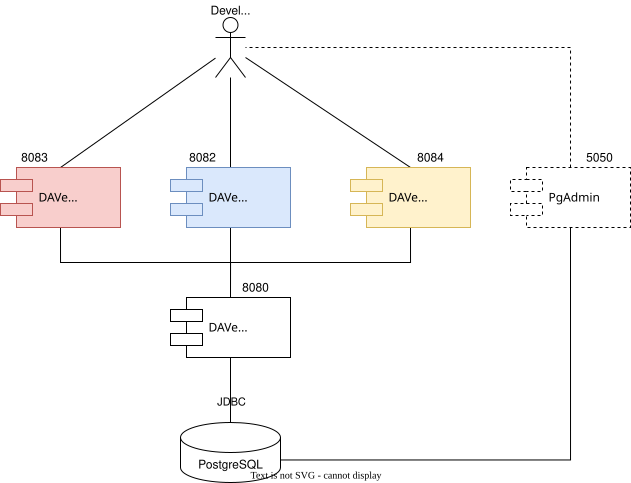

# Docker Compose
For local development Docker Compose file in this folder can be used. As DAVe consists of multiple components, it is helpful to start everything else, when working on just one component.

## TL;DR

```bash
sudo docker compose up
```
After everything has started, use links from the following table, to access various application parts.
| Component         | Access URL             |Description            | 
| ------------------| -----------------------|-----------------------|
| DAVe Admin Portal | http://localhost:8083  | Manage DAVe           | 
| DAVe Frontend     | http://localhost:8082  | Access count data     | 
| DAVe SelfService  | http://localhost:8084  | Add manual count data | 
| PgAdmin           | http://localhost:5050  | Database access       | 


## Component Overview

Following image shows, what is going to run, if you use provided Compose script.

