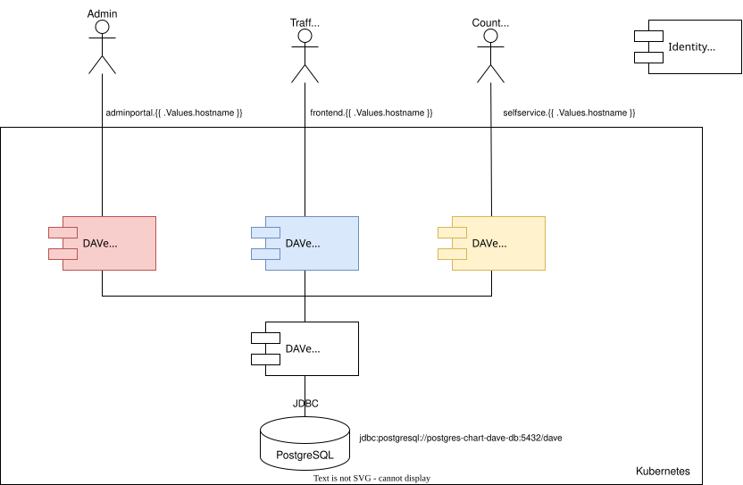

# Helmfile Deployment
Helmfile is a great tool to compose multi-component applications. Here you find information on how to deploy DAVe with Helmfile.

If you want to know more about Helmfile see [docs](https://helmfile.readthedocs.io/en/latest/)

## TL;DR

```bash
cp env.sh-template myenvironment-env.sh
# edit values
source myenvironment-env.sh
helmfile -e remote -f dave.yaml.gotmpl diff
# check if everything is correct
helmfile -e remote -f dave.yaml.gotmpl apply
```

## Deployment Overview
When deploying DAVe to a Kubernetes cluster the following components are installed by the Helmfile in this repository.



By default the three components with user interface (Frontend, SelfService, AdminPortal) will be reachable under seperated subdomains. Based on the hostname provided in env file (see [env section](#using-helmfile)) the subdomains are added to base domain.

## Using Helmfile
The following values are necessary to deploy DAVe.

```bash
# IdP data
export REALM_NAME=realmname
export CLIENT_SECRET=anothersecret

# Strong password for database
export DAVE_DB_PW=dave_db_pw

# Base URL to reach application
export HOSTNAME=cluster.local

# pull landing page from private repo
export GITHUB_TOKEN=token

# DAVe adapter config
export API_CLIENT_ID=dave_api
export API_CLIENT_SECRET=secret
export ANALYTICS_USERNAME=analytics
export ANALYTICS_PASSWORD=analytics
```